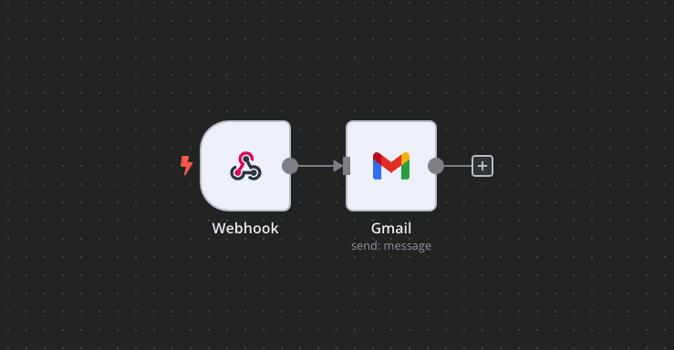
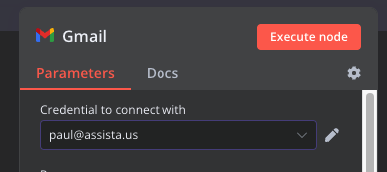
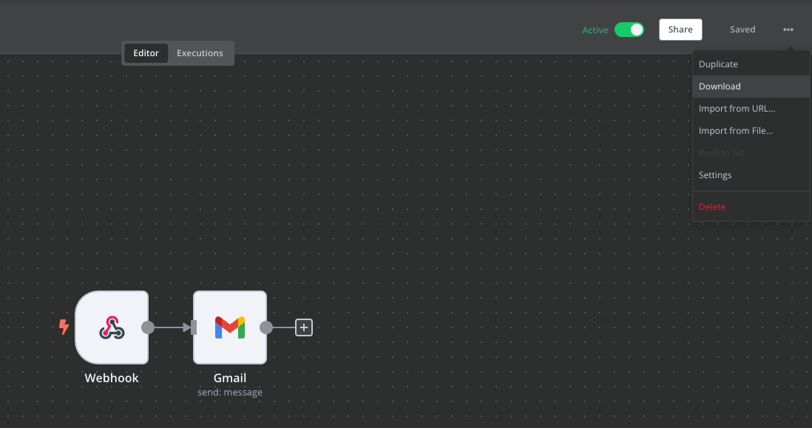

# Service Classes

- [Service Classes](#service-classes)
  - [Credential Service classes](#credential-service-classes)
  - [Workflow Service classes](#workflow-service-classes)
  - [How would you go about building one of this classes?](#how-would-you-go-about-building-one-of-this-classes)
  - [What's next?](#whats-next)
  
## Credential Service classes
:::tip
  This class is used to make the API call to N8N and create a credential instance there
:::
We would like to follow this design pattern where we create service accounts for each type of credential.
```ruby title="app/services/credentials/gmail_o_auth2.rb"
module Credentials
  class GmailOAuth2
  end
end
```

## Workflow Service classes
:::tip
  This class is used to make the API call to N8N and create a workflow instance there and to run the workflow after it has been created
:::
We would like to follow this design pattern where we create service accounts for each type of workflow.
```ruby title="app/services/workflows/gmail.rb"
module Workflows
  class Gmail
  end
end
```

## How would you go about building one of this classes?
1. First thing is to make the workflow that you need in N8N interface
:::tip
For workflows that are triggered by the agent we create them with a webhook trigger
:::


:::warning
Ensure you add the required credential in N8N (using N8N interface this time)

:::
2. When we have the workflow behaving the way we want we can download it to see exactly what configuration we have to make in the service classes using the API.


Gmail workflow looks like so:
```json
{
  "name": "Gmail",
  "nodes": [
    {
      "parameters": {
        "sendTo": "={{ $json.body.email }}",
        "subject": "={{ $json.body.subject }}",
        "message": "={{ $json.body.body }}",
        "options": {
          "appendAttribution": false
        }
      },
      "name": "Gmail",
      "type": "n8n-nodes-base.gmail",
      "typeVersion": 2.1,
      "position": [
        1000,
        360
      ],
      "id": "e27c1f17-2375-4518-87f4-4859a361b345",
      "credentials": {
        "gmailOAuth2": {
          "id": "i0PUxn3a5Qu48RE3",
          "name": "paul@assista.us"
        }
      }
    },
    {
      "parameters": {
        "httpMethod": "POST",
        "path": "gmail-webhook-user6-credential11",
        "options": {}
      },
      "name": "Webhook",
      "type": "n8n-nodes-base.webhook",
      "typeVersion": 1,
      "position": [
        840,
        360
      ],
      "id": "2c481a13-84d9-49f3-9ac4-7b2864d5cdac"
    }
  ],
  "pinData": {},
  "connections": {
    "Webhook": {
      "main": [
        [
          {
            "node": "Gmail",
            "type": "main",
            "index": 0
          }
        ]
      ]
    }
  },
  "active": true,
  "settings": {
    "saveExecutionProgress": true,
    "saveManualExecutions": true,
    "saveDataErrorExecution": "all",
    "saveDataSuccessExecution": "all",
    "executionTimeout": 3600,
    "timezone": "America/New_York"
  },
  "versionId": "8b1a17df-3ec2-4bb2-8975-4cce6731bfd3",
  "id": "wxr54s8oljE9hMrz",
  "meta": {
    "instanceId": "80c21c7ada9ea3b1765b5470942387c901c49c88945f5ce035c62cd32d630397"
  },
  "tags": []
}
```

And in Assista we build this like that:

```ruby
    private

    def base_headers
      {
        "Accept": 'application/json',
        "Content-Type": 'application/json'
      }
    end

    def headers
      base_headers.merge("X-N8N-API-KEY": ENV['N8N_API_KEY'])
    end

    def body
      {
        "name": "User#{@user.id} - sendGmail",
        "nodes": [gmail_node, webhook_node],
        "connections": connections,
        "settings": settings
      }
    end

    def gmail_node
      {
        "parameters": gmail_params,
        "name": 'Gmail',
        "type": 'n8n-nodes-base.gmail',
        "typeVersion": 2.1,
        "position": [1000, 360],
        "credentials": credentials
      }
    end

    def gmail_params
      {
        "sendTo": '={{ $json.body.email }}',
        "subject": '={{ $json.body.subject }}',
        "message": '={{ $json.body.body }}',
        "options": {
          "appendAttribution": false
        }
      }
    end

    def credentials
      {
        "gmailOAuth2": {
          "id": @credential.n8n_id,
          "name": @credential.email || @user.email
        }
      }
    end

    def webhook_node
      {
        "parameters": webhook_params,
        "name": 'Webhook',
        "type": 'n8n-nodes-base.webhook',
        "typeVersion": 1,
        "position": [840, 360]
      }
    end

    def webhook_path
      "gmail-webhook-user#{@user.id}-credential#{@credential.id}"
    end

    def webhook_params
      {
        "httpMethod": 'POST',
        "path": webhook_path,
        "options": {}
      }
    end

    def connections
      {
        "Webhook": {
          "main": [
            [
              {
                "node": 'Gmail',
                "type": 'main',
                "index": 0
              }
            ]
          ]
        }
      }
    end

    def settings
      {
        "saveExecutionProgress": true,
        "saveManualExecutions": true,
        "saveDataErrorExecution": 'all',
        "saveDataSuccessExecution": 'all',
        "executionTimeout": 3600,
        "timezone": 'America/New_York'
      }
    end
```

:::info
Basically we copy all the values from the JSON and create a service that builds exactly the same thing (except ids and other unique values that are assigned by n8n automatically)
:::

## What's next?

- Read the [official documentation](https://docusaurus.io/)
